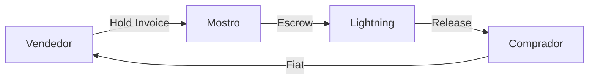

# Mostro

## P2P Bitcoin sobre Lightning + Nostr

GetAlby Community Call — Febrero 2026

---

# ¿Qué es Mostro?

Exchange P2P de Bitcoin **sin custodia**, sobre **Lightning** y **Nostr**.

- **Non-custodial**: hold invoices como escrow
- **Sin KYC**: solo wallet Lightning + Nostr keys
- **Censorship resistant**: NIP-59 gift wrap
- **Open source**: core en Rust

---

# App Beta — Flutter

### 📱 NWC Integrado

Conectá tu propia wallet:
- Alby
- Mutiny
- Zeus

### 🔄 Restore de Trades

Backup automático entre dispositivos. Cambiás de celular, recuperás todo.

### 💬 Dispute Chat

Thread privado admin-seller-buyer, gift-wrapped. Todo en la app.

**+100 testers activos** — Public beta coming soon 🚀

---

# Mostro-skills

## Integración con IA

Skill de OpenClaw para operar Mostro vía chat:

- Crear órdenes
- Tomar trades
- Gestionar disputas

User:

Creame una orden de venta por 100k sats

Mostronator:

Orden creada: #1234

Seller: @user

Amount: 100,000 sats

Fiat: USD

🤖 **Trader P2P 24/7** en tu chat de Telegram

---

# Mostro Community

## mostro.community

Programa recién lanzado para ayudar a **comunidades Bitcoin** a correr su propio nodo Mostro.

### Qué incluye:

- Soporte técnico
- Configuración guiada
- Mejores prácticas
- Visibilidad en la app

**Open source siempre**: cualquiera puede deployar sin permiso.  
El programa facilita el camino.

---

# Herramientas para Operadores

### 🖥️ Mostrix

Gestioná disputas desde desktop. Sin app móvil.

### 🔔 Mostro-watchdog

Bot de Telegram para admins:
- Monitoreo en tiempo real
- Notificaciones de disputas
- Health checks de relays

### 📊 Mostro-score-web

Análisis de reputación:
- Fetcha eventos Nostr
- Métricas objetivas
- Transparencia total

---

# Challenges Recientes

### 🚀 Onboarding

**Problema**: Fricción al juntar Nostr keys + Lightning wallet  
**Solución**: Embedded wallets en test

### 🔔 Notificaciones

**Problema**: Dependencia de FCM/Google  
**Experimento**: Push vía Nostr relays + background sync

### 💰 Liquidez

**Problema**: Necesitamos más makers  
**Focus**: LATAM y África

---

# Cierre

## ¿Cómo participar?

### Mostro está en:

- ✅ **Mainnet**
- ✅ **Beta global**
- ✅ **mostro.community** recién lanzado

### Sumate si:

- Operás P2P y querés ser **maker**
- Tenés una comunidad Bitcoin
- Querés **testear** la app

🌐 **mostro.community**  
💻 **github.com/MostroP2P**

Gracias 🧌

---

# Preguntas?

🧌 Mostro — P2P Bitcoin sin custodia

mostro.community | github.com/MostroP2P

