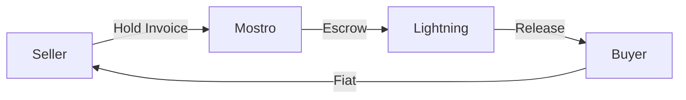

  

# Mostro

## P2P Bitcoin on Lightning + Nostr

GetAlby Community Call — February 2026

---

# What is Mostro?

Non-custodial **P2P Bitcoin exchange** on **Lightning** and **Nostr**.

- **Non-custodial**: Lightning hold invoices as escrow
- **No KYC**: just Lightning wallet + Nostr keys
- **Censorship resistant**: NIP-59 gift wrap encryption
- **Open source**: Rust core, anyone can run a node

---

# App Beta — Flutter

### 📱 NWC Integrated

Connect your own wallet:
- Alby
- Mutiny
- Zeus

### 🔄 Trade Restore

Automatic backup across devices. Change phones, recover everything.

### 💬 Dispute Chat

Private admin-seller-buyer thread, gift-wrapped. All in the app.

**+100 active testers** — Public beta on zapstore and github! 🥳

---

# Mostro-skills

## AI Integration

OpenClaw skill to operate Mostro via chat:

- Create orders
- Take trades
- Manage disputes

User:

Create a sell order for 100k sats

Mostronator:

Order created: #1234

Seller: @user

Amount: 100,000 sats

Fiat: USD

🤖 **24/7 P2P trader**

---

# Mostro Community

## mostro.community

Freshly launched program to help **Bitcoin communities** run their own Mostro node.

### What's included:

- Technical support
- Guided setup
- Best practices
- Visibility in the app

**Always open source**: anyone can deploy without permission.  
The program just makes the journey easier.

---

# Tools for Operators

### 🖥️ Mostrix

Manage disputes from desktop. No mobile app needed.

### 🔔 Mostro-watchdog

Telegram bot for admins:
- Real-time monitoring
- Dispute notifications
- Relay health checks

### 📊 Mostro-score-web

Reputation analysis:
- Fetches Nostr events
- Objective metrics
- Full transparency

---

# Recent Challenges

### 🚀 Onboarding

**Problem**: Friction combining Nostr keys + Lightning wallet  
**Solution**: Embedded wallets in testing

### 🔔 Notifications

**Problem**: Dependency on FCM/Google  
**Experiment**: Push via Nostr relays + background sync

### 💰 Liquidity

**Problem**: We need more makers  
**Focus**: LATAM and Africa

---

# Closing

## How to get involved?

### Mostro is on:

- ✅ **Mainnet**
- ✅ **Global beta**
- ✅ **mostro.community** freshly launched

### Join if you:

- Trade P2P and want to be a **maker**
- Have a Bitcoin community
- Want to **test** the app

🌐 **mostro.network**  
🌐 **mostro.community**  
💻 **github.com/MostroP2P**

Thanks 🧌

---

# Questions?

🧌 Mostro — Non-custodial P2P Bitcoin

mostro.network | mostro.community | github.com/MostroP2P

